# Node-RED ROS 2 Plugin

[](https://opensource.org/licenses/MIT)

This project is started as an fork of [node-red-ros2-plugin](https://github.com/eProsima/node-red-ros2-plugin) from eProsima. We removed the [Integration Service](https://integration-service.docs.eprosima.com/en/latest/) and added ROS service client and ROS action client using the Java Script ROS API, [rclnodejs](https://github.com/RobotWebTools/rclnodejs).

|   |    Version 0.3.x of edu_nodered_ros2_plugin switches its ROS2 middleware from FastRTPS (the ROS2 default) to Cyclone DDS! This change is important because these two middlewares are not fully compatible. Therefore, if you update to version 0.3.x you have to make your sure that your whole ROS2 infrastructure uses the same middleware!    <br> <br>    If you wish to keep FastRTPS as your middleware, you can do this by simply editing a parameter file. Please refer to [this guide](https://github.com/EduArt-Robotik/edu_robot/blob/main/documentation/update/changing-middleware.md) (repository: edu_robot) on how to adjust the middleware settings for the docker containers and your system! |
|---|----|

## Installation

### Checking if Node-Red is already Installed

It may happen that the **compose-up** command fails because port 1880 is already in use. The application that caused this error can be determined with the following command:

```bash
sudo netstat -tulpn
```
This command will print out a table with all used ports at moment. The 3. column shows on which ip and port an application is listening:

```bash
tcp   0   0 0.0.0.0:1880    0.0.0.0:*    LISTEN   27803/node-red 
```

In this case, the port is already in use by another Node Red installation. If this instance is installed on a Debian-based system, it can be uninstalled by :

```bash
sudo apt remove node-red 
```

### Checking on a EduArt's Robot

If Node-Red should be installed on a EduArt's Robot than you have to connect to the robot first using command ssh. For this the robot's IP address is required. For installing or updating the Node-Red software a internet connection is required, this means usually the robot is connected by an ethernet connection to your local network. What leads in a IP address assigned by the DHCP server of your network. Either get the IP address from the router (usually by using its web interface) or use the tool nmap:

```bash
sudo nmap -sn <your local subnet, for example: 192.168.1.0/24>
```

A list of all devices connected to your local subnet is shown. Pick the robot's IP. We assume the robot's IP is 192.168.0.100 from this point on. Connect to the robot using:

```bash
ssh root@192.168.0.100
```

Now use the instruction from section before.


### Installing EduArt's Node-Red ROS2 Plugin

The plugin comes with a Node-Red installation deployed in a Docker image. This makes it easy to install and use. First get the open source code by cloning the repository on your target machine, most likely on a robot:

```bash
git clone https://github.com/EduArt-Robotik/edu_nodered_ros2_plugin.git 
```

Go inside the docker folder where the compose file is located:

```bash
cd edu_nodered_ros2_plugin/docker/ 
```

Then execute the command:

```bash
docker compose up
```

The Node-Red web server will start up. The docker container will be autostart after a reboot or if an error occurred.


### Updating EduArt's Node-Red ROS2 Plugin

#### Checking

To be always up to date, it is worth checking the system regularly for updates. To do this, change to the "home" directory and then into the folder "edu_nodered_ros2_plugin" and execute the commands:

```bash
git checkout master
git pull origin
```

The output will tell you if there is a new version of the code.

#### Update

Don't worry previously performed work in Node-Red will be preserved as the data is stored outside the Docker container. First remove current version. Go into the folder where the docker compose file is located: 

```bash
cd edu_nodered_ros2_plugin/docker/ 
```

Now the new version can be started by the command: 

```bash
docker compose up
```

The container will be stopped and the new pulled and started.


## Usage

> **_Note_** : we assume that the Node-Red server is running on the IP address 192.168.0.100. If this differs to your network configuration please replace the IP address accordingly.

Open a browser you like enter the following address to visit the Node-Red web interface: http://192.168.0.100:1880. 
This will open the typical NodeRed window.

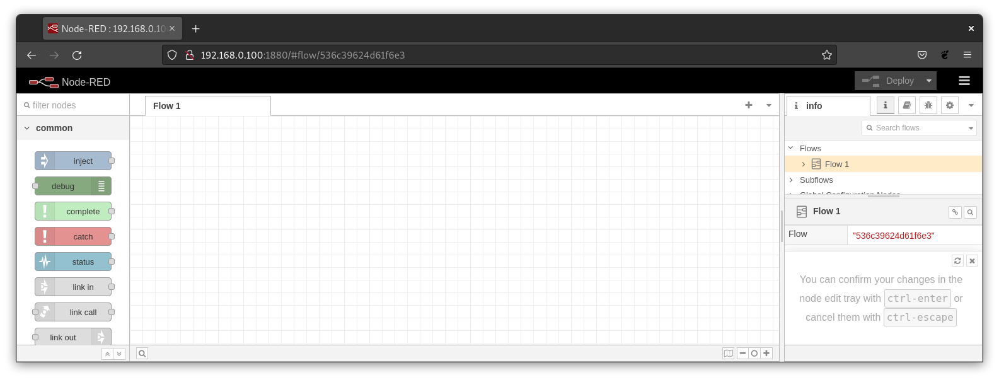

> **_Remember_** : your computer needs to be in the same Network as the robot. This could now also be the internal Router as the robot needs no internet anymore. 

### Node-RED palette

The main concepts associated with Node-RED operation are explained [here](https://nodered.org/docs/user-guide/concepts).
The plugin nodes are displayed on the Node-RED palette as shown in the image. From there, they can be dragged into the
flow workspace.

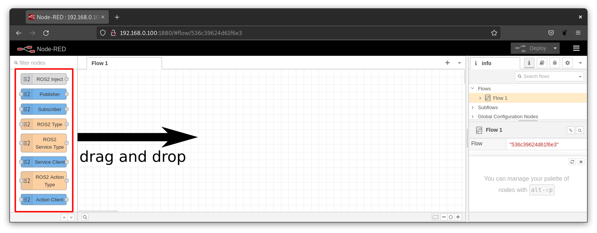

These palette represents the basic ROS client features like publishing and subscribing to a ROS topic, requesting an ROS service or performing a ROS action. With this features it should be possible to control existing ROS system like a robot and to use higher level application like the [Nav2 (Navigation Stack)](https://navigation.ros.org/).

> **_Note_** : the text that labels the node, changes from palette to workspace, and may change depending on the node
configuration.

### Publishing and Subscribing to an ROS Topic

In order the publish or subscribe data we need first to specify the associated type. The topic type is represented by the node **ROS2 Type**. It is required that the **ROS2 Type** is connected to the **Publisher** or **Subscriber** Node.

#### Choosing a ROS2 type

<table>
    <tr>
        <td width="250"></td>
        <td> This node represents a specific ROS2 Types installed on the system. Once in the workspace, its set up dialog can be opened by double clicking over it.
        </td>
    </tr>
    <tr>
        <td></td>
        <td> The dialog provides a Package drop-down control where all ROS2 msg packages are listed. </br>
             Once a package is selected the Message drop-down control allows selection of a package specific message.
             In this example the package selected is <tt>edu_robot</tt>.
             From this package the <tt>RobotStatusReport</tt> message is selected.
        </td>
    </tr>
    <td>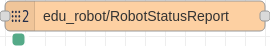</td>
    <td> Once the dialog set up is saved, the node label changes to highlight the selected type in a <tt>package/message</tt> pattern.
    </td>
</table>


#### Injecting a type instance into the pipeline

Node-RED pipelines start in *source nodes*. The most popular one is the [inject
node](https://nodered.org/docs/user-guide/nodes#inject) which requires the user to manually defined each field
associated to the type. In order to simplify this a specific node is introduced:

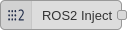

This node mimics the inject node behaviour but automatically populates the input dialog with the fields associated with
any *type node* linked to it. For example, if we wire together a **ROS2 Inject** and a **ROS2 Type** as
shown in the figure:

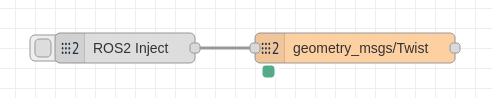

The associated dialogs are populated with the linked type fields and types. For example the twist message is populated as:

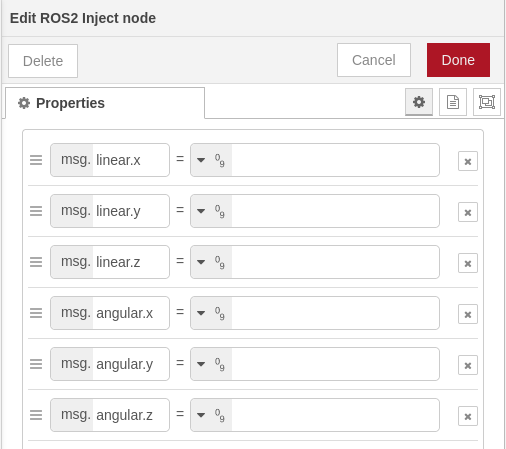

#### ROS2 nodes: General Settings

In order to interact with a ROS2 environment we must specify the same [domain id](https://docs.ros.org/en/jazzy/Concepts/Intermediate/About-Domain-ID.html)
in use for that environment.

The *domain id* is a number in the range `[0, 166]` that provides isolation for ROS2 nodes.
It defaults to 0 and its main advantage is reduce the incomming traffic for each ROS2 node, discharging them and
speeding things up.

Another key concepts in the ROS2 environment are:

- [topic](https://docs.ros.org/en/jazzy/Tutorials/Beginner-CLI-Tools/Understanding-ROS2-Topics/Understanding-ROS2-Topics.html)
one. A *topic* is a text string ROS2 nodes use to notify all other nodes in which data they are interested.
When a ROS2 node wants to send or receive data it must specify:
 + Which type is the data they want receive. For example the `edu_robot/RobotStatusReport` we introduced [above](#choosing-a-predefined-ros2-type).
 + Topic associated with the data. For example `/status_report`, but in ROS2 topics are often *decorated* using
namespaces to simplify identification, as in `/eduard/red/status_report`.

- [Quality of Service (QoS)](https://docs.ros.org/en/jazzy/Concepts/Intermediate/About-Quality-of-Service-Settings.html). Those are
  policies that allow fine tunning of the communication between nodes. For example:
  + *History QoS* allows to discard messages if only the most recent one is meaningful for our purposes.
  + *Reliable QoS* enforces message reception by resending it until the receiver acknowledges it.
  + *Durability QoS* assures messages published before the receiver node creation would be delivered.

> **_Note:_** ROS2 nodes can only communicate if their respective QoS are compatible. Information on QoS compatibility
  is available [here](https://docs.ros.org/en/jazzy/Concepts/Intermediate/About-Quality-of-Service-Settings.html).

#### ROS2 Subscriber

<table>
    <tr>
        <td width="250"></td>
        <td>This node represents a ROS2 subscriber. It is able to subscribe on a specific topic and receive all messages
        published for it.</td>
    </tr>
    <tr>
        <td>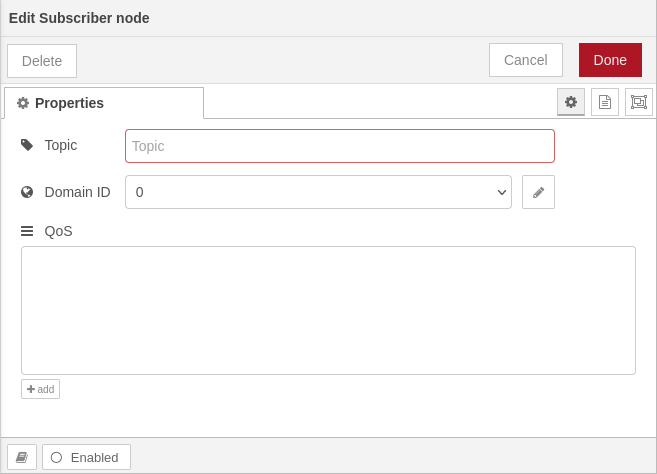</td>
        <td>The dialog provides controls to configure:
            <dl>
                <dt>Topic</dt><dd>Note that the backslash <tt>/</tt> typical of ROS2 topics is not necessary</dd>
                <dt>Domain ID</dt><dd>Selected globally via the configuration node explained
                <a href="#ros2-configuration-node">above</a></dd>
                <dt>QoS</dt><dd>The <tt>+add</tt> button at the bottom adds new combo-boxes to the control where the
                available options for each policy can be selected</dd>
            </dl>
        </td>
    </tr>
</table>

##### Example

This example shows how to subscribe to an topic and display it using the **debug** node. It is based on the available topics of an EduArt's robot like Eduard.


#### ROS2 Publisher

<table>
    <tr>
        <td width="250"></td>
        <td>This node represents a ROS2 publisher. It is able to publish messages on a specific topic with specific QoS</td>
    </tr>
    <tr>
        <td>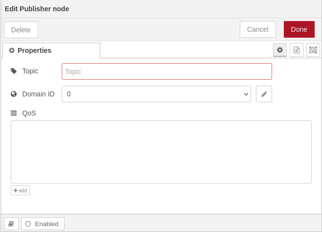</td>
        <td>The dialog provides controls to configure:
            <dl>
                <dt>Topic</dt><dd>Note that the backslash <tt>/</tt> typical of ROS2 topics is not necessary</dd>
                <dt>Domain ID</dt><dd>Selected globally via the configuration node explained
                <a href="#ros2-configuration-node">above</a></dd>
                <dt>QoS</dt><dd>The <tt>+add</tt> button at the bottom adds new combo-boxes to the control where the
                available options for each policy can be selected</dd>
            </dl>
        </td>
    </tr>
</table>

##### Example

This example shows how to publish to an topic and display the published message using the **debug** node. It is based on the available topics of an EduArt's robot like Eduard.

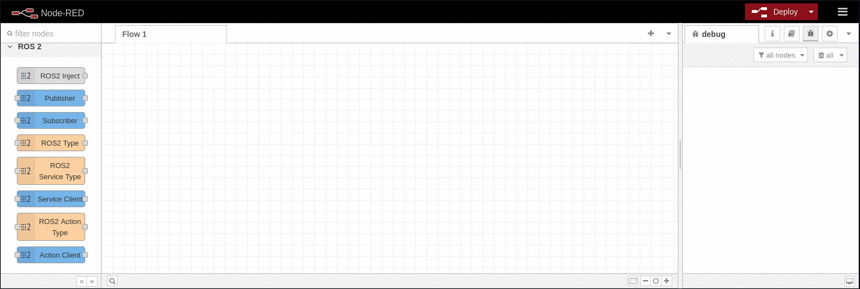

### ROS2 Service Client

In order to call or request an ROS service we need first to specify the associated type. The service type is represented by the node **ROS2 Service Type**. It is required that the **ROS2 Service Type** is connected to the **Service Client** node.

<table>
    <tr>
        <td width="250">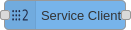</td>
        <td>This node represents a ROS2 service client. It is able to call a specific service with specific QoS. The connected injection injects the service request only. After a successful service call the service response is output.</td>
    </tr>
    <tr>
        <td></td>
        <td>The dialog provides controls to configure:
            <dl>
                <dt>Service</dt><dd>Note that the backslash <tt>/</tt> typical of ROS2 services is not necessary</dd>
                <dt>Domain ID</dt><dd>Selected globally via the configuration node explained
                <a href="#ros2-configuration-node">above</a></dd>
                <dt>QoS</dt><dd>The <tt>+add</tt> button at the bottom adds new combo-boxes to the control where the
                available options for each policy can be selected</dd>
            </dl>
        </td>
    </tr>
</table>

#### Example

This example shows how to call a service and displays the response using a **debug** node. It is based on the available topics of an EduArt's robot like Eduard. In this example the robot is switched in mode **autonomous drive**.

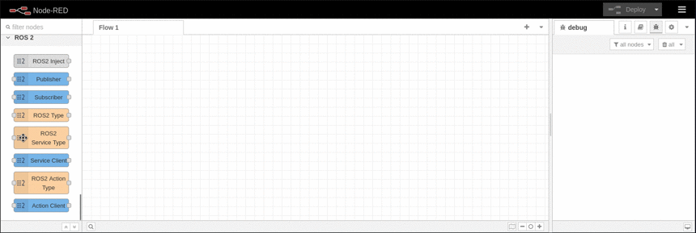


### ROS2 Action Client

In order to perform a ROS action we need first to specify the associated type. The action type is represented by the node **ROS2 Action Type**. It is required that the **ROS2 Action Type** is connected to the **Action Client** node.

<table>
    <tr>
        <td width="250"></td>
        <td>This node represents a ROS2 action client. It is able to perform a specific action with specific QoS. The connected injection injects the action goal request only. After a accepted action goal the action feedback and the final result is outputted.</td>
    </tr>
    <tr>
        <td>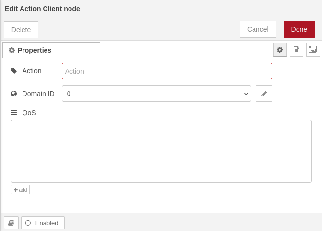</td>
        <td>The dialog provides controls to configure:
            <dl>
                <dt>Action</dt><dd>Note that the backslash <tt>/</tt> typical of ROS2 topics is not necessary</dd>
                <dt>Domain ID</dt><dd>Selected globally via the configuration node explained
                <a href="#ros2-configuration-node">above</a></dd>
                <dt>QoS</dt><dd>The <tt>+add</tt> button at the bottom adds new combo-boxes to the control where the
                available options for each policy can be selected</dd>
            </dl>
        </td>
    </tr>
</table>

#### Example

This example shows how to perform a action and displays the feedback and result using two **debug** nodes. It is based on the ROS action tutorial [turtle sim](https://docs.ros.org/en/foxy/Tutorials/Beginner-CLI-Tools/Understanding-ROS2-Actions/Understanding-ROS2-Actions.html#ros2-action-send-goal). If you want to reproduce it the turtle sim node has to be launched like in the tutorial.


### ROS2 Examples

[Don't hit the Wall](docs/example-dont-hit-the-wall/example-dont-hit-the-wall.md)