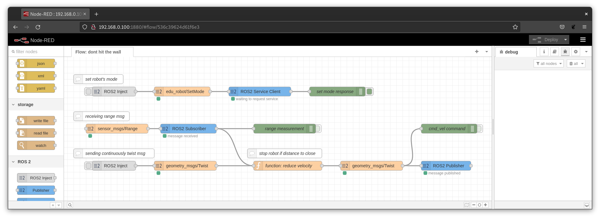
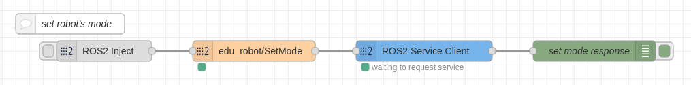
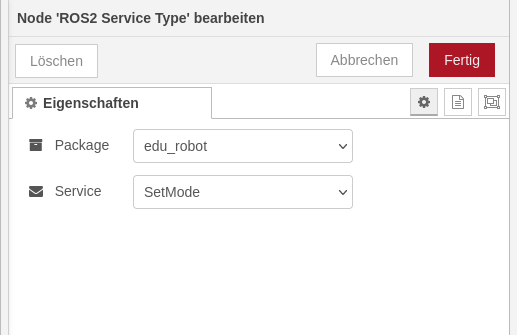
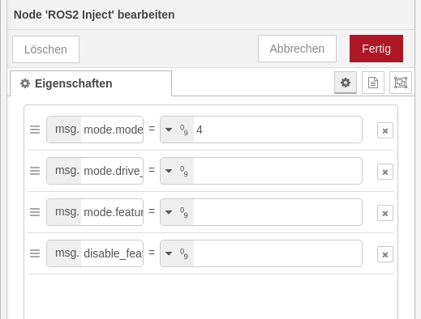
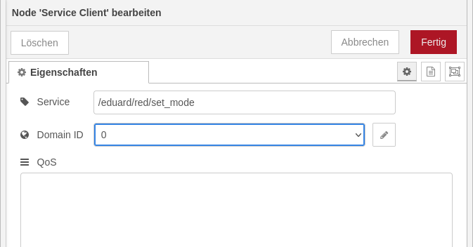
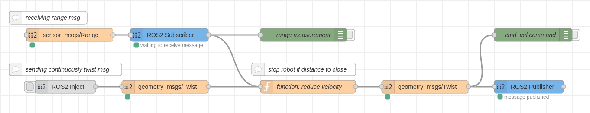
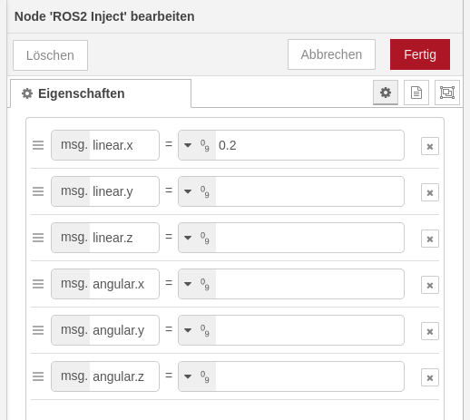

# Example: Don't hti the Wall

This example shows how a application using Node-Red could look like. It receives measurements from one of the distance sensors of the robot Eduard and reduces the sent velocity, which is also sent in this example, in case of a close distance.

If you simply want to try it you can use [this file](flow-example-dont-hit-the-wall.json) and import it into Node-Red using the import function.

Below all parts of the Node-Red flow are described part by part. The following figure shows an overview of the finished network:


## Set Mode

When using NodeRed you should always use the mode **AUTONOMOUS**. This mode has the number “4”. In the future the names of the modes not only the numbers will be usable in NodeRed. Lets work with “4” for now.

> **Note**: our robots got different modes. We highly recommend to use mode **AUTONOMOUS** for applications where the robot drives autonomously. This has the advantage that if you want to control the robot manually, e.g. because it is performing a destructive action, you can simply switch the mode to **REMOTE CONTROLLED**. This way the robot no longer listens to the commands of the application but to those of the operator.

When sending mode 4 the robot gets enabled and drive ready. The debug on the right will display if the robot was able to set this mode. It can fail if the robot is currently charging or the disable push button is pressed. Make sure that the conditions for readiness to drive are given (neither emergency button is pressed or power cable is plugged in).  



Start with the orange “ROS2 Service Type”-Node. Drag and drop this node and configure the node as follows:



In order to be able to use a service or a subscriber, information must first be entered into the network. This can be done via a "ROS2 Inject" as a static value, or also via a function. In this example, we use a "ROS2 Inject". This block can be found under "ROS 2". The following figure shows the configuration of this block:



Next the “Service Client” needs to be configured. Next figure shows how to configure this for our example with an orange robot:



This network alone seems boring but it is very necessary to be able to actually drive the robot with the next network.  By the way the network does exactly the same as pressing the left shoulder button on the PlayStation 5 Controller.


## Processing Distance Measurements

Now this is where the real fun starts. Be careful that the robot is not able to drop off a table or a cliff. It may start spontaneously when pressing deploy depending what you have send before. We recommend to lift up the robot using the included rack. 

The next figure shows an overview of the bigger network of our last example:



You can see two debug blocks that can output the range of the sensor and the velocity that is send to the motor controller (cmd_vel). In the function block there are two inputs. The first is for the range measurement of the front left range sensor. The second is for the fist start-up to once inject a velocity. This is due the communication protocol of the robot. There is only communication from the motor controller (which also handles the range information) to the computer if previously a state or velocity is send by the computer. We will come to the explanation of **function: reduce velocity** in a minute. 

As you have previously learned, you always need to define the Type. In this example we have **sensor_msgs/Range** and **geometry_msgs/Twist**.

Let us now come to the configuration of the blocks and fast forward some steps. Start with the configuration of the **ROS2 Type** blocks. Configure the package (sensor_msgs for example) and the message (Range for example). Do it this way for all three type definition blocks.  

Let’s now come to the **ROS2 Subscriber**:

|||
|----|----|
|topic name:| /eduard/red/range/front/left/range |
|Domain ID:| 0 |

And the **ROS2 Publisher**:  
|||
|-|-|
|topic name:| /eduard/red/autonomous/cmd_vel |
Domain ID:|0|

Configure the ROS2 Inject as follows:



And please set every where a **Domain ID** to 0.

> Note: the Domain ID has no effect at the moment. But it could lead to an error if unset.

### Function Node: Reduce Velocity

The heart of the application is **function: reduce velocity**. This is where a check is made if the robot will drive with 0.2 m/s to the front or stops in front an obstacle.  

```js
// storing input values
if (msg.payload["range"] != undefined) {
    // if range is defined than input is a range measurement
    context.set("range", msg.payload["range"]); 
} 
else if (msg.payload["linear"] != undefined) { 
    // if linear is defined than input is a twist message.
    context.set("twist", msg.payload); 
} 

// checking if distance is to close
if (context.get("range") < 0.2) {
    // override received twist command
    let twist = context.get("twist"); 

    twist.linear.x = 0.0; 
    twist.linear.y = 0.0; 
    twist.angular.z = 0.0; 

    context.set("twist", twist); 
}

// publish twist command
msg = { payload: context.get("twist") }; 

return msg; 
```